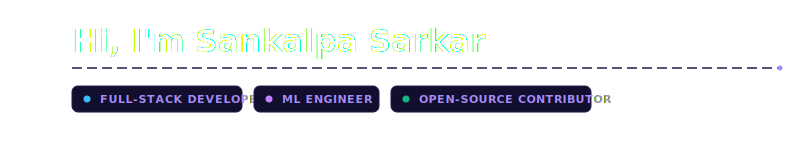
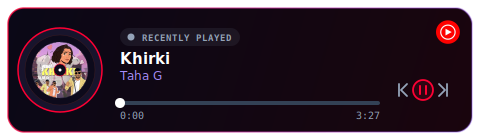
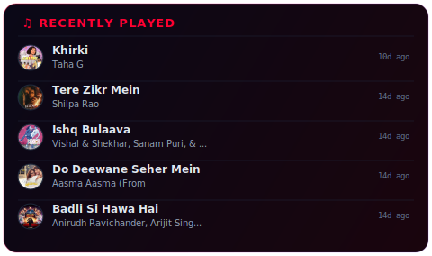
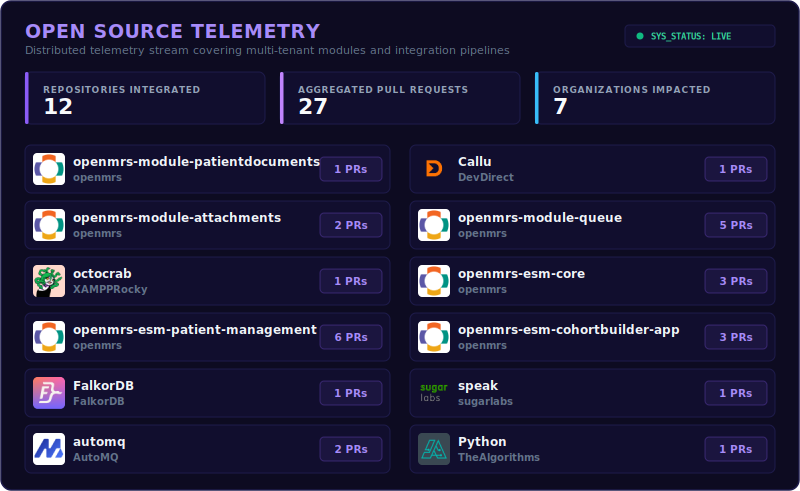
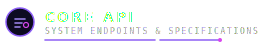
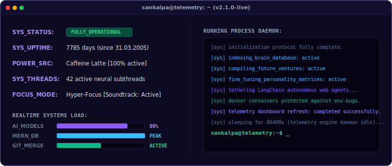

  

  
  
  
  
  
  

---

I'm a passionate developer who loves building scalable systems, developing intelligent machine learning models, and contributing back to the open-source community. My work sits at the intersection of full-stack engineering and modern AI, creating functional solutions that scale beautifully.

---

   
  

---

<!-- MUSIC_START -->
<!-- auto-updated by .github/workflows/update-contributions.yml -->

  

<!-- MUSIC_END -->

<!-- RECENT_TRACKS_START -->
<!-- auto-updated by .github/workflows/update-contributions.yml -->

  

<!-- RECENT_TRACKS_END -->

---

  <table width="100%" style="border-collapse: collapse; border: none; background: transparent;">
    <tr>
      <td width="50%" align="center" style="border: none; padding: 15px; vertical-align: top;">
         
        
          
        <strong>Founder &amp; Principal Architect</strong>
          
        Helping&nbsp;Businesses&nbsp;scale&nbsp;with&nbsp;custom&nbsp;Software&nbsp;Solutions.
      </td>
      <td width="50%" align="center" style="border: none; padding: 15px; vertical-align: top;">
         
        
          
        <strong>Creator &amp; Lead AI Engineer</strong>
          
        AI assistant that twins your coding habits.
      </td>
    </tr>
  </table>

---

<!-- Row 1: Core Languages & Frontend (9 Icons) -->

  
<!-- Row 2: Database, Cloud & ML Infrastructure (9 Icons) -->

  
<!-- Row 3: DevOps, Tooling & Specialized AI/Deployment (10 Icons Symmetric Grid) -->
&nbsp;&nbsp;&nbsp;&nbsp;

---

<!-- OSS_CONTRIBUTIONS_START -->
<!-- auto-updated by .github/workflows/update-contributions.yml -->

  

<!-- OSS_CONTRIBUTIONS_END -->

---

  <table width="100%" style="border-collapse: collapse; border: none; background: transparent; font-family: monospace; font-size: 13px;">
    <tr style="background: rgba(139, 92, 246, 0.05);">
      <th align="left" style="border: none; padding: 12px; color: #a78bfa;">API Endpoint</th>
      <th align="center" style="border: none; padding: 12px; color: #a78bfa;">Status</th>
      <th align="left" style="border: none; padding: 12px; color: #a78bfa;">Response Payload</th>
    </tr>
    <tr>
      <td style="border: none; padding: 12px; color: #38bdf8; text-align: left;"><code>GET /sankalpa/focus</code></td>
      <td align="center" style="border: none; padding: 12px; color: #10b981;"><code>200 OK</code></td>
      <td style="border: none; padding: 12px; color: #e2e8f0; text-align: left;">
        <code>{ "state": "hyper_focused", "caffeine": "active", "soundtrack": "lofi_beats" }</code>
      </td>
    </tr>
    <tr>
      <td style="border: none; padding: 12px; color: #38bdf8; text-align: left;"><code>POST /sankalpa/deploy</code></td>
      <td align="center" style="border: none; padding: 12px; color: #10b981;"><code>201 CREATED</code></td>
      <td style="border: none; padding: 12px; color: #e2e8f0; text-align: left;">
        <code>{ "system": "MERN_stack", "latency": "&lt;15ms", "uptime": "99.99%" }</code>
      </td>
    </tr>
    <tr>
      <td style="border: none; padding: 12px; color: #38bdf8; text-align: left;"><code>GET /sankalpa/ai-stack</code></td>
      <td align="center" style="border: none; padding: 12px; color: #10b981;"><code>200 OK</code></td>
      <td style="border: none; padding: 12px; color: #e2e8f0; text-align: left;">
        <code>{ "frameworks": ["LangChain", "PyTorch"], "models": ["LLM_FineTune", "RAG"] }</code>
      </td>
    </tr>
  </table>

---

  
  <!-- Row 1: Profile Overview & Top Languages (Perfect Height Alignment & Dynamic Sizing) -->
  &nbsp;&nbsp;&nbsp;&nbsp;&nbsp;&nbsp;&nbsp;&nbsp;&nbsp;&nbsp;
  
  
    
  <!-- Row 2: Consistency Tracker (Balanced Layout) -->
  
  
    
  
  <!-- Row 3: Development Velocity Timeline (Balanced Layout) -->
  

---

---

<!-- TELEMETRY_START -->
<!-- auto-updated by .github/workflows/update-contributions.yml -->

  

<!-- TELEMETRY_END -->

---

